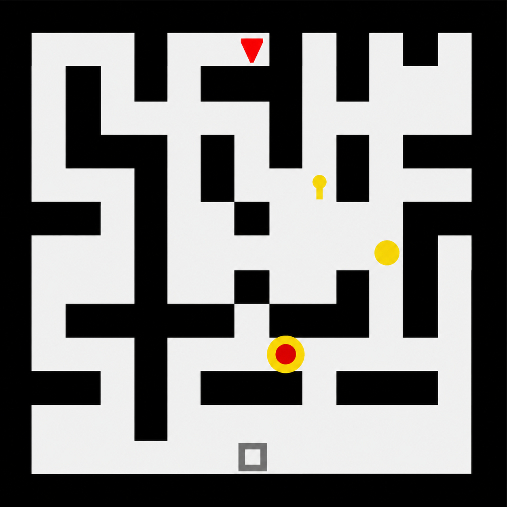

# Academic Project Page Template

> **Update (September 2025)**: This template has been modernized with better design, SEO, and mobile support. For the original version, see the [original-version branch](https://github.com/eliahuhorwitz/Academic-project-page-template/tree/original-version).

A clean, responsive template for academic project pages.


Example project pages built using this template are:
- https://horwitz.ai/probex
- https://vision.huji.ac.il/probegen
- https://horwitz.ai/mother
- https://horwitz.ai/spectral_detuning
- https://vision.huji.ac.il/ladeda
- https://vision.huji.ac.il/dsire
- https://horwitz.ai/podd
- https://dreamix-video-editing.github.io
- https://horwitz.ai/conffusion
- https://horwitz.ai/3d_ads/
- https://vision.huji.ac.il/ssrl_ad
- https://vision.huji.ac.il/deepsim


## Start using the template
To start using the template click on `Use this Template`.

The template uses html for controlling the content and css for controlling the style. 
To edit the websites contents edit the `index.html` file. It contains different HTML "building blocks", use whichever ones you need and comment out the rest.  

### Alternative Versions

- `index.html`: Implements **Option A (Image Grid Comparison)** where all 9 generated level maps (3 models × 3 samples) are shown in a static grid.
- `index_B.html`: Implements **Option B (Carousel Slider Comparison)** where maps are grouped by sample in an auto-playing slider.
- `index_C.html`: Implements **Option C (Comparison Tabs)** where maps are categorized by model (GRPO, SFT, Vanilla) and can be toggled via Bulma tab controls.

**IMPORTANT!** Make sure to replace the `favicon.ico` under `static/images/` with one of your own, otherwise your favicon is going to be a dreambooth image of me.

## What's New

- Modern, clean design with better mobile support
- Improved SEO with proper meta tags and structured data
- Performance improvements (lazy loading, optimized assets)
- More Works dropdown
- Copy button for BibTeX citations
- Better accessibility

## Page Sections

- Abstract
- Problem + Motivation (two-column layout, widescreen container)
- Methodology (How We Define Fun? + SFT + Multi-Reward GRPO)
- Results (comparison table + visualization graphs + generated level samples comparison grid)
- Ablation Study (ablation table)
- Conclusion (summary + Limitations + Future Work cards)
- References

## Customization

The HTML file has TODO comments showing what to replace:

- Paper title, authors, institution, conference
- Links (arXiv, GitHub, etc.)
- Abstract and descriptions  
- Videos, images, and PDFs
- Related works in the dropdown
- Meta tags for SEO and social sharing

### Meta Tags
The template includes meta tags for better search engine visibility and social media sharing. These appear in the `<head>` section and help with:
- Google Scholar indexing
- Social media previews (Twitter, Facebook, LinkedIn)
- Search engine optimization

Create a 1200x630px social preview image at `static/images/social_preview.png`.

### Placeholder Border Customization

If you want to remove the dashed border and background from a placeholder figure container (e.g. when you replace it with an actual image but want to maintain center alignment and spacing), you can append the `plain-figure` class to the element. This class will also remove the default padding and min-height constraint to optimize the vertical spacing between elements:

```html
<div class="placeholder-figure plain-figure" id="problem-figure">
  
</div>
```

## Tips

- Compress images with [TinyPNG](https://tinypng.com)
- Use YouTube for large videos (>10MB)  
- Replace the favicon in `static/images/`
- Works with GitHub Pages

## Acknowledgments
Parts of this project page were adopted from the [Nerfies](https://nerfies.github.io/) page.

## Website License
<a rel="license" href="http://creativecommons.org/licenses/by-sa/4.0/"></a><br />This work is licensed under a <a rel="license" href="http://creativecommons.org/licenses/by-sa/4.0/">Creative Commons Attribution-ShareAlike 4.0 International License</a>.
